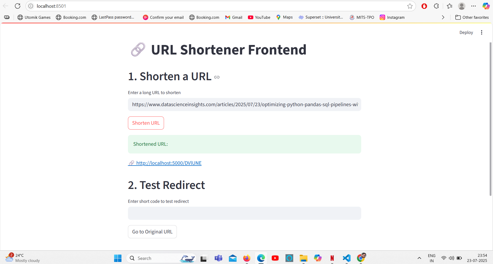
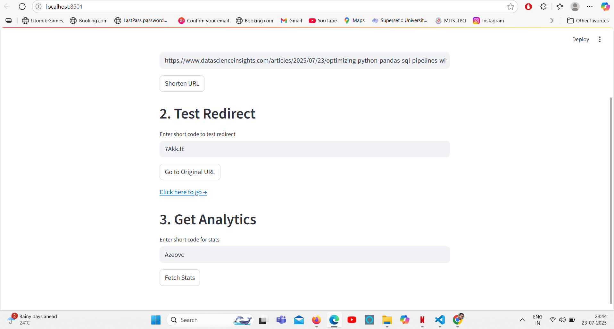
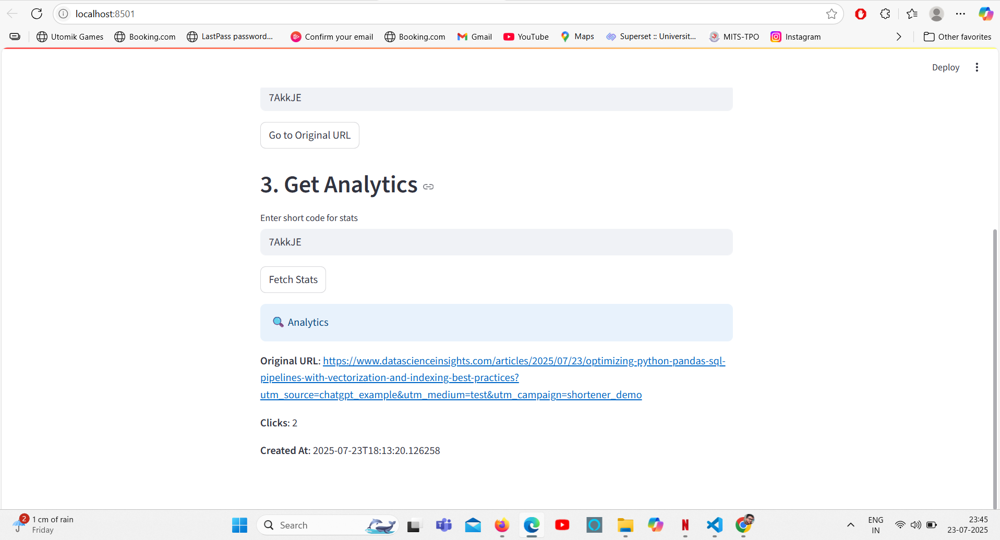

# URL Shortener Service

**A simple in‑memory Flask API + Streamlit frontend**  
– Shorten any valid URL to a 6‑character code  
– Redirect to the original URL, tracking click counts  
– View analytics (clicks, timestamp)  
– Thread‑safe, tested with pytest 

### Frontend Demo

## 📝 Implementation Notes

- **Backend (Flask API)**  
  - `main.py` defines 4 endpoints:  
    1. **Health**: `GET /`  
    2. **Shorten**: `POST /api/shorten`  
    3. **Redirect**: `GET /<short_code>`  
    4. **Analytics**: `GET /api/stats/<short_code>`  
  - In‑memory stores:  
    - `url_store` holds `{ short_code: { url, created_at } }`  
    - `click_store` tracks click counts  
  - Thread‑safe via `threading.Lock()`  
  - URL validation with a regex in `is_valid_url()`  
  - Short codes: 6‑character alphanumeric from `generate_short_code()`

- **Frontend (Streamlit)**  
  - `url_shortener_frontend.py` provides:  
    1. URL shortening form  
    2. Redirect tester  
    3. Analytics viewer  
  - Communicates with Flask at `http://localhost:5000`

- **Testing (pytest)**  
  - `test_main.py` uses fixtures to:  
    - Spin up a Flask test client  
    - Clear in‑memory stores before each test  
  - Covers success and error cases for all endpoints

- **Running the Project**  
  1. Install deps:  
     pip install -r requirements.txt
       
  2. Start API:  
     flask --app main run

  3. Launch frontend:  
     streamlit run url_shortener_frontend.py
     
  4. Run tests:  
     pytest -q
     

- **Future Improvements**  
  - Swap in a persistent database (SQLite, PostgreSQL)  

